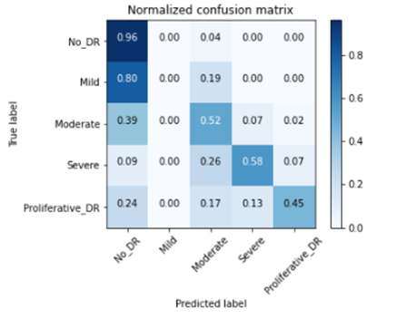
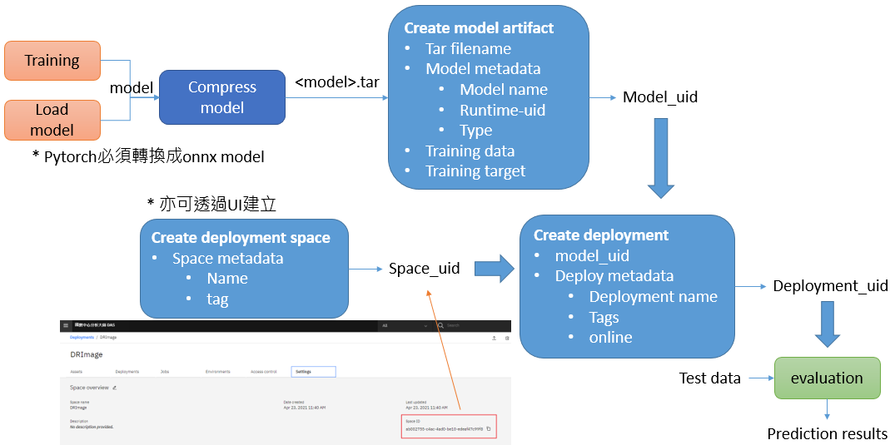

# 14.3 Image Classification 

## Introduction

* 目標：透過有標記之眼底影像來偵測是否有糖尿病引發的視網膜病變
* 類別：分為五種嚴重程度
    - 0 - No DR
    - 1 - Mild
    - 2 - Moderate
    - 3 - Severe
    - 4 - Proliferative DR
* framework: Pytorch

## Data preparation
* From Kaggle:
    https://www.kaggle.com/c/diabetic-retinopathy-detection#description
* For training
    * Text data
        * train_img.csv / train_img_small.csv
        * train_label.csv/ train_label_small.csv
        * test_img.csv/ test_img_small.csv
        * test_label.csv/ test_label_small.csv
    * Image data
        * data/<#>_left.jpeg
        * data/<#>_right.jpeg

## 資料展示

- [notebook](https://github.com/thesuperorange/DAS_DRImage/blob/main/fundus_data.ipynb)

* 內容--資料觀察
    1. label distribution

        

    2. preview images

        

## 訓練模型
- [notebook](https://github.com/thesuperorange/DAS_DRImage/blob/main/DR_main.ipynb)

* 內容
    1. Dataloader
    2. Training 
    3. Plot results

        * accuracy comparison

            

        * confusion matrix

            

## 模型佈署
- [notebook](https://github.com/thesuperorange/DAS_DRImage/blob/main/deploy_onnx_model.ipynb)

* 佈署流程

* 內容
    1. load Pytorch model
    2. convert to pytorch_onnx model format
    3. compress model
    4. create model artiface
    5. get deployment space id
    6. create deployment
    7. evaluation

## Reference
* Specifying a model type and software specification
https://www.ibm.com/support/producthub/icpdata/docs/content/SSQNUZ_latest/wsj/wmls/wmls-deploy-python-types.html
